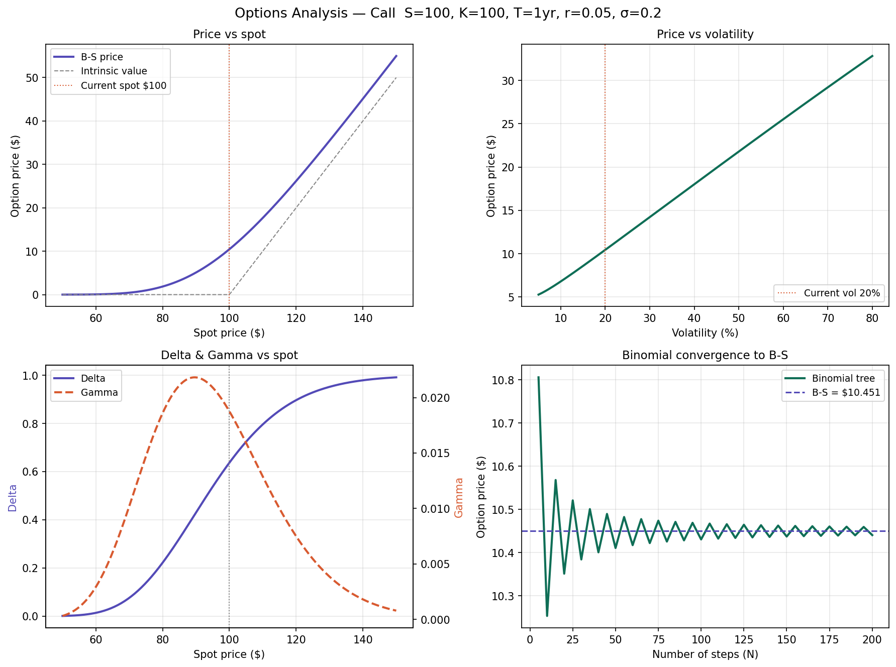

# Options Pricer

A Black-Scholes options pricing model built from scratch in Python as part of 
my transition into quantitative finance. Coming from a bioinformatics background, 
this was my first deep dive into derivatives pricing — building it from the ground 
up was how I made sure I actually understood the maths rather than just running 
someone else's code.

## What it does

- Prices European call and put options using the Black-Scholes formula
- Calculates the five main Greeks (Delta, Gamma, Theta, Vega, Rho)
- Compares Black-Scholes price against a binomial tree model
- Visualises how price and Greeks change with spot price, volatility and time

## How to run

pip install numpy scipy matplotlib
python3 black\ scholes.py

## Output

## Technologies
below are the softwares that i used:
- Python 3
- NumPy
- SciPy
- Matplotlib

## Background

Built from scratch as Project 1 of my quant finance portfolio. The binomial tree 
converges to the Black-Scholes price as the number of steps increases, which I 
used to verify both implementations are correct.

## What I learned

The most interesting part was building the binomial tree independently and watching 
it converge to the Black-Scholes price as the number of steps increases — that was 
the moment the maths clicked. I also found the Greeks more intuitive once I could 
see them plotted against spot price, particularly how Gamma peaks exactly at the 
money where Delta is changing fastest.
